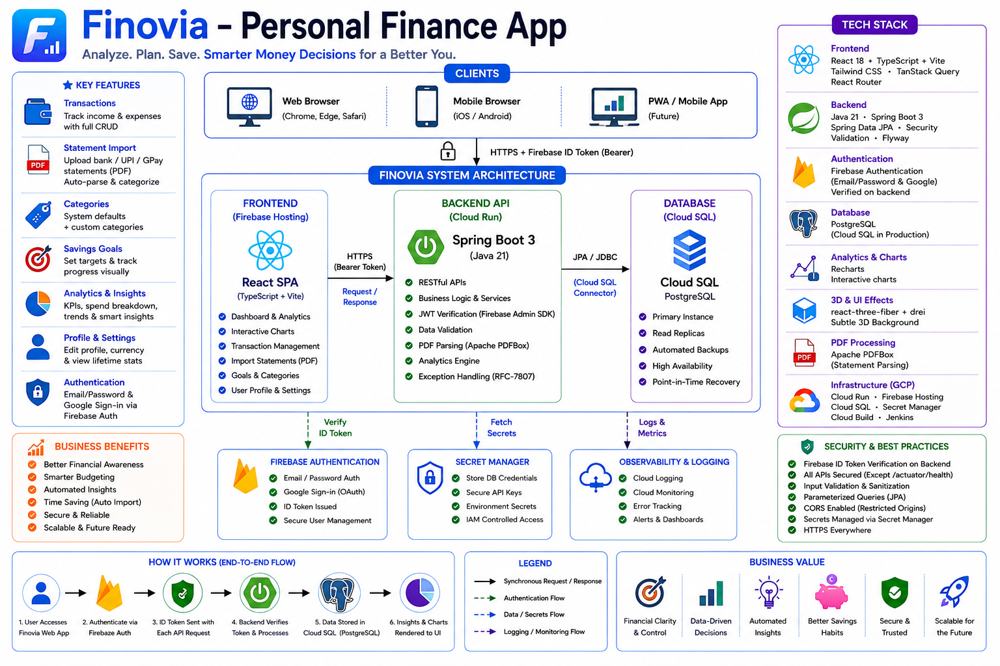

# Finovia — Personal Finance App

A full-stack personal finance app to track expenses, income, and savings goals. An analytics
engine turns your spending habits into actionable budgeting insights, all presented on a sleek
dashboard with interactive charts and a subtle animated 3D background. Import bank/UPI
statements as PDFs and let the app auto-categorize and record your transactions.

## Contents

- [Features](#features)
- [Tech stack](#tech-stack)
- [Architecture](#architecture)
- [Repository layout](#repository-layout)
- [Local development](#local-development)
- [API reference](#api-reference)
- [Deployment](#deployment)
- [Security](#security)

## Features

- **Transactions** — full CRUD for expenses and income, organized by category.
- **Statement import** — upload a bank / UPI / GPay statement PDF; rows are parsed,
  auto-categorized, and saved, with a summary of what was imported and skipped.
- **Categories** — system defaults seeded per user, plus your own custom categories.
- **Savings goals** — set targets and track progress with a visual ring.
- **Analytics** — KPIs, spend-by-category, income-vs-expense, savings trend, and
  rule-based budgeting insights over any date range.
- **Profile** — editable display name and base currency, plus lifetime account stats.
- **Auth** — email/password and Google sign-in via Firebase, verified server-side.

## Tech stack

| Layer       | Choice                                                                       |
| ----------- | ---------------------------------------------------------------------------- |
| Backend     | Java 21 · Spring Boot 3 (Web, Data JPA, Security, Validation, Flyway)         |
| Auth        | Firebase Authentication (backend verifies ID tokens via Firebase Admin SDK)  |
| Database    | PostgreSQL (Neon free serverless tier in production)                          |
| Frontend    | React 18 + TypeScript + Vite · Tailwind CSS · TanStack Query · React Router   |
| Charts / 3D | Recharts · react-three-fiber + drei                                          |
| PDF import  | Apache PDFBox (server-side statement parsing)                                |
| Infra       | GCP: Cloud Run · Firebase Hosting · Secret Manager · Artifact Registry · Jenkins; Neon (DB) |

## Architecture



Every request carries a Firebase ID token. `FirebaseTokenFilter` verifies it and sets a
`FirebaseUserPrincipal`; services resolve the matching `app_user` row (just-in-time
provisioning) and scope **all** queries by `user_id` for tenant isolation.

## Repository layout

```
backend/         Spring Boot API — controllers, services, JPA domain, Flyway migrations
frontend/        Vite React SPA — pages, charts, auth, API client
infra/           docker-compose (local Postgres), Cloud Build config, deployment runbook
Jenkinsfile      CI/CD pipeline definition
firebase.json    Firebase Hosting config
```

## Local development

### Prerequisites

- Java 21 and Maven
- Node 20+
- Docker (for local PostgreSQL and backend Testcontainers)
- A Firebase project with Email/Password and Google sign-in enabled

### 1. Start PostgreSQL

```bash
docker compose -f infra/docker-compose.yml up -d
```

### 2. Run the backend

Provide Firebase credentials so the Admin SDK can verify tokens — either set
`FIREBASE_CREDENTIALS_PATH` to a service-account JSON, or rely on Application Default
Credentials (`gcloud auth application-default login`).

```bash
cd backend
export FIREBASE_PROJECT_ID=your-firebase-project-id
export FIREBASE_CREDENTIALS_PATH=/path/to/service-account.json   # optional
./mvnw spring-boot:run
```

The API runs at `http://localhost:8080`. Flyway applies migrations automatically.
Health check: `GET http://localhost:8080/actuator/health`.

### 3. Run the frontend

```bash
cd frontend
cp .env.example .env.local      # fill in Firebase web config + VITE_API_BASE_URL
npm install
npm run dev
```

The app runs at `http://localhost:5173`.

### Tests

```bash
cd backend && ./mvnw test        # JUnit + Testcontainers (requires Docker)
cd frontend && npm test          # Vitest
```

## API reference

All endpoints (except `/actuator/health`) require an `Authorization: Bearer <Firebase ID token>`
header.

| Method                | Path                               | Purpose                                  |
| --------------------- | ---------------------------------- | ---------------------------------------- |
| `GET`                 | `/api/me`                          | Current user (provisions on first call)  |
| `PUT`                 | `/api/me`                          | Update display name / base currency      |
| `GET`                 | `/api/me/stats`                    | Lifetime account statistics              |
| `GET POST PUT DELETE` | `/api/transactions[/{id}]`         | Expense / income CRUD                    |
| `POST`                | `/api/transactions/import`         | Import transactions from a statement PDF |
| `GET POST PUT DELETE` | `/api/categories[/{id}]`           | Categories (system defaults seeded)      |
| `GET POST PUT DELETE` | `/api/goals[/{id}]`                | Savings goals CRUD                       |
| `GET`                 | `/api/analytics/summary`           | KPIs + rule-based insights               |
| `GET`                 | `/api/analytics/spend-by-category` | Pie / donut data                         |
| `GET`                 | `/api/analytics/income-vs-expense` | Monthly bar data                         |
| `GET`                 | `/api/analytics/savings-trend`     | Cumulative savings line                  |

- Analytics endpoints accept `from` and `to` query params (ISO `yyyy-MM-dd`).
- `POST /api/transactions/import` is `multipart/form-data` with a `file` (PDF) and an optional
  `password` for encrypted statements.

## Deployment

A **zero-cost** stack at personal scale: **Cloud Run** (backend, scales to zero / free tier) +
**Firebase Hosting** & **Auth** (free) + **Neon** free serverless PostgreSQL, with **Jenkins**
CI/CD on a GCE VM.

> **Full step-by-step runbook: [infra/DEPLOYMENT.md](infra/DEPLOYMENT.md).** The
> [`Jenkinsfile`](Jenkinsfile) defines the pipeline and
> [infra/jenkins/startup.sh](infra/jenkins/startup.sh) provisions the Jenkins VM.

### Pipeline at a glance

`mvn clean package` (build + tests) → build Docker image → push to **Artifact Registry** →
`gcloud run services update` (rolls the new image onto the pre-created Cloud Run service) →
build frontend → `firebase deploy --only hosting`. Jenkins authenticates with a service-account
key (`gcp-secret-key` credential).

### Database

The backend talks to **Neon** over a standard SSL JDBC URL via its default Spring profile
(`DB_URL` / `DB_USER` / `DB_PASSWORD`) — no Cloud SQL, no `gcp` profile, no code changes.
The runbook covers creating the Neon project and wiring the pooled connection string.

### Keeping it free

Cloud Run, Hosting, Auth, and Neon all stay within free limits. The only potential GCP charge is
the Jenkins `e2-medium` VM — **stop it when idle** (`gcloud compute instances stop jenkins`) and
start it only to deploy, or run Jenkins locally.

## Security

- Stateless auth — tokens verified server-side on every request.
- Row-level ownership enforced in the service layer (`findByIdAndUserId`).
- Monetary values stored as `NUMERIC(14,2)` — never floating point.
- Secrets kept in Secret Manager, never in images or source.
- CORS restricted to the SPA origin.
- Uploaded statements are validated as PDFs and parsed in-memory only.
