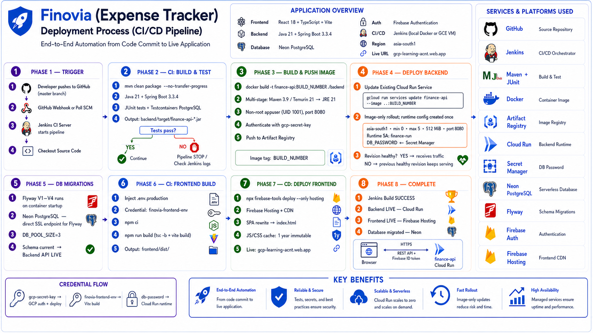

<div align="center">

# 💰 Finovia — Personal Finance App

**Track expenses, income, and savings goals — with analytics-driven insights on a clean, responsive dashboard.**

[](https://gcp-learning-acnt.web.app/)
&nbsp;


**🔗 [Open the live app](https://gcp-learning-acnt.web.app/)** — sign in with email/password or Google to try it.

</div>

---

## Overview

Finovia is a full-stack personal finance app. It lets you record income and expenses, set savings
goals, and import bank / UPI / GPay statement PDFs that are parsed and auto-categorized. A
rule-based analytics engine turns your activity into budgeting insights — viewable since your last
salary, for the current month, trailing periods, or any custom date range — and an optional
weekly/monthly email digest delivers a summary to your inbox.

## Contents

- [Features](#features)
- [Tech stack](#tech-stack)
- [Architecture](#architecture)
- [Repository layout](#repository-layout)
- [Getting started](#getting-started)
- [Configuration](#configuration)
- [API reference](#api-reference)
- [Deployment](#deployment)
- [Security](#security)

## Features

**Money management**
- **Transactions** — full CRUD for expenses and income, organized by category.
- **Statement import** — upload a bank / UPI / GPay statement PDF; rows are parsed,
  auto-categorized, and saved, with a summary of what was imported and skipped.
- **Categories** — system defaults seeded per user plus your own; every category resolves to a
  context-aware icon (keyword-matched, so custom names get one too).
- **Savings goals** — set targets and track progress with a visual ring.

**Insights**
- **Analytics** — KPIs, spend-by-category, income-vs-expense, savings trend, and rule-based
  budgeting insights.
- **Flexible periods** — view any metric **since your last salary**, for the current month,
  trailing 3 / 6 / 12 months, or a **custom date range**. "Left from salary" = salary − expenses.
- **Email digest** — opt into a **weekly** or **monthly** summary email (income, spending, top
  categories, insights) delivered via SMTP and triggered by Cloud Scheduler, with a one-click
  "send test" from the Account page. Degrades gracefully when email isn't configured.

**Experience**
- **Multi-currency** — base currency per user (defaults to **INR**); amounts use locale-aware,
  tabular figures.
- **Polished UI** — clean, professional light theme, fully responsive (mobile bottom-nav and
  cards that stack down to 360px), with colour-coded sections and rich iconography.
- **Profile** — editable display name, base currency, and digest preference, plus lifetime stats.
- **Auth** — email/password and Google sign-in via Firebase, verified server-side.

## Tech stack

| Layer      | Technology                                                                    |
| ---------- | ----------------------------------------------------------------------------- |
| Backend    | Java 21 · Spring Boot 3 (Web, Data JPA, Security, Validation, Flyway, Mail)    |
| Auth       | Firebase Authentication (backend verifies ID tokens via Firebase Admin SDK)   |
| Database   | PostgreSQL — Neon free serverless tier in production                           |
| Frontend   | React 18 · TypeScript · Vite · Tailwind CSS · TanStack Query · React Router    |
| Charts/UI  | Recharts · lucide-react icons                                                  |
| PDF import | Apache PDFBox (server-side statement parsing)                                  |
| Email      | Spring Mail over SMTP (e.g. Brevo free tier) + Cloud Scheduler triggers        |
| Infra      | GCP — Cloud Run · Firebase Hosting · Secret Manager · Artifact Registry; Neon  |
| CI/CD      | Jenkins (local in Docker via Cloudflare Tunnel, or a GCE VM)                   |

## Architecture


Every request carries a Firebase ID token. `FirebaseTokenFilter` verifies it and sets a
`FirebaseUserPrincipal`; services resolve the matching `app_user` row (just-in-time provisioning)
and scope **all** queries by `user_id` for tenant isolation. Internal scheduler endpoints
(`/api/internal/**`) are exempt from Firebase auth and gated by a shared-secret header instead.

## Repository layout

```
backend/         Spring Boot API — controllers, services, JPA domain, Flyway migrations
frontend/        Vite React SPA — pages, charts, auth, API client
infra/           docker-compose (local Postgres), deployment runbook, Jenkins setup (local + VM)
images/          Architecture & deployment diagrams
Jenkinsfile      CI/CD pipeline definition
firebase.json    Firebase Hosting config
```

## Getting started

### Prerequisites

- Java 21 and Maven
- Node 20+
- Docker (for local PostgreSQL and backend Testcontainers)
- A Firebase project with Email/Password and Google sign-in enabled

### 1. Start PostgreSQL

```bash
docker compose -f infra/docker-compose.yml up -d
```

### 2. Run the backend

Provide Firebase credentials so the Admin SDK can verify tokens — either set
`FIREBASE_CREDENTIALS_PATH` to a service-account JSON, or rely on Application Default Credentials
(`gcloud auth application-default login`).

```bash
cd backend
export FIREBASE_PROJECT_ID=your-firebase-project-id
export FIREBASE_CREDENTIALS_PATH=/path/to/service-account.json   # optional
./mvnw spring-boot:run
```

The API runs at `http://localhost:8080`; Flyway applies migrations automatically.
Health check: `GET http://localhost:8080/actuator/health`.

### 3. Run the frontend

```bash
cd frontend
cp .env.example .env.local      # fill in Firebase web config + VITE_API_BASE_URL
npm install
npm run dev
```

The app runs at `http://localhost:5173`.

### 4. Run the tests

```bash
cd backend && ./mvnw test        # JUnit + Testcontainers (requires Docker)
cd frontend && npm test          # Vitest
```

## Configuration

Configuration is entirely environment-driven, so the same build runs locally and in the cloud.

**Backend** (`backend/src/main/resources/application.yml`)

| Variable | Purpose | Default |
| --- | --- | --- |
| `DB_URL` / `DB_USER` / `DB_PASSWORD` | PostgreSQL connection | local docker-compose |
| `DB_POOL_SIZE` | Hikari max pool size | `5` |
| `FIREBASE_PROJECT_ID` | Firebase project for token verification | — |
| `FIREBASE_CREDENTIALS_PATH` | Service-account JSON (else uses ADC) | empty (ADC) |
| `CORS_ALLOWED_ORIGINS` | Comma-separated allowed SPA origins | `http://localhost:5173` |
| `PUBLIC_URL` | SPA URL used in digest email links | live Hosting URL |
| `MAIL_ENABLED` | Master switch for outbound email | `false` |
| `MAIL_HOST` / `MAIL_PORT` | SMTP server | — / `587` |
| `MAIL_USERNAME` / `MAIL_PASSWORD` | SMTP credentials | — |
| `MAIL_FROM` / `MAIL_FROM_NAME` | Verified sender address / display name | — / `Finovia` |
| `DIGEST_TOKEN` | Shared secret for the scheduler digest endpoint | empty (disabled) |

> Email is optional: with `MAIL_HOST` unset (or `MAIL_ENABLED=false`) sends are skipped and
> logged, never failing. `MAIL_FROM` must be a sender verified with your email provider.

**Frontend** (build-time `VITE_*`, baked into the bundle)

| Variable | Purpose |
| --- | --- |
| `VITE_API_BASE_URL` | Backend API base URL (e.g. `https://<cloud-run-url>/api`) |
| `VITE_FIREBASE_API_KEY` · `VITE_FIREBASE_AUTH_DOMAIN` · `VITE_FIREBASE_PROJECT_ID` · `VITE_FIREBASE_APP_ID` | Firebase web config |

## API reference

All endpoints except `/actuator/health` and `/api/internal/**` require an
`Authorization: Bearer <Firebase ID token>` header. The `/api/internal/**` digest trigger is
instead protected by a shared-secret `X-Digest-Token` header (for Cloud Scheduler).

| Method                | Path                               | Purpose                                  |
| --------------------- | ---------------------------------- | ---------------------------------------- |
| `GET`                 | `/api/me`                          | Current user (provisions on first call)  |
| `PUT`                 | `/api/me`                          | Update display name / currency / digest  |
| `GET`                 | `/api/me/stats`                    | Lifetime account statistics              |
| `POST`                | `/api/me/digest/test`              | Send the current user a test digest now  |
| `POST`                | `/api/internal/digests/run`        | Scheduler-triggered digest run (token)   |
| `GET POST PUT DELETE` | `/api/transactions[/{id}]`         | Expense / income CRUD                    |
| `POST`                | `/api/transactions/import`         | Import transactions from a statement PDF |
| `GET POST PUT DELETE` | `/api/categories[/{id}]`           | Categories (system defaults seeded)      |
| `GET POST PUT DELETE` | `/api/goals[/{id}]`                | Savings goals CRUD                       |
| `GET`                 | `/api/analytics/summary`           | KPIs + rule-based insights               |
| `GET`                 | `/api/analytics/spend-by-category` | Pie / donut data                         |
| `GET`                 | `/api/analytics/income-vs-expense` | Monthly bar data                         |
| `GET`                 | `/api/analytics/savings-trend`     | Cumulative savings line                  |

- Analytics endpoints accept `from` and `to` query params (ISO `yyyy-MM-dd`).
- `POST /api/transactions/import` is `multipart/form-data` with a `file` (PDF) and an optional
  `password` for encrypted statements.

## Deployment

A **zero-cost** stack at personal scale: **Cloud Run** (backend, scales to zero / free tier) +
**Firebase Hosting** & **Auth** (free) + **Neon** free serverless PostgreSQL. CI/CD runs through
**Jenkins** — recommended **locally in Docker** (truly $0), exposed to GitHub webhooks via a
**Cloudflare Tunnel**; a GCE VM is an optional always-on alternative.



> **Full step-by-step runbook: [infra/DEPLOYMENT.md](infra/DEPLOYMENT.md).** The
> [`Jenkinsfile`](Jenkinsfile) defines the pipeline, [infra/jenkins/local/](infra/jenkins/local/)
> runs Jenkins locally with a Cloudflare Tunnel (see its
> [README](infra/jenkins/local/README.md)), and
> [infra/jenkins/startup.sh](infra/jenkins/startup.sh) provisions an optional Jenkins VM.

### Pipeline at a glance

`mvn clean package` (build + tests) → build Docker image → push to **Artifact Registry** →
`gcloud run services update` (rolls the new image onto the pre-created Cloud Run service) →
build frontend → `firebase deploy --only hosting`. Jenkins authenticates with a service-account
key (`gcp-secret-key` credential).

### Database

The backend talks to **Neon** over a standard SSL JDBC URL via its default Spring profile
(`DB_URL` / `DB_USER` / `DB_PASSWORD`) — no Cloud SQL, no `gcp` profile, no code changes. Use
Neon's **direct** (non-pooled) endpoint with `?sslmode=require`: the app runs Flyway migrations at
startup, which need session advisory locks that Neon's PgBouncer pooler doesn't support. The
password is supplied to Cloud Run from **Secret Manager** (`db-password`), never in plaintext.

### Email digest

To enable the weekly/monthly digest in production: store the SMTP key and a `DIGEST_TOKEN` in
Secret Manager, add the `MAIL_*` / `PUBLIC_URL` config to the Cloud Run service, and create two
**Cloud Scheduler** jobs (weekly + monthly) that POST to `/api/internal/digests/run` with the
`X-Digest-Token` header. See [DEPLOYMENT.md §12](infra/DEPLOYMENT.md).

### Keeping it free

Cloud Run, Hosting, Auth, Neon, and Cloud Scheduler all stay within free limits. Running
**Jenkins locally in Docker** keeps CI/CD at $0 — start it (and the Cloudflare Tunnel) only when
deploying. If you instead run Jenkins on a GCE `e2-medium` VM, **stop it when idle**
(`gcloud compute instances stop jenkins`) and start it only to deploy.

## Security

- Stateless auth — Firebase ID tokens verified server-side on every request.
- Row-level ownership enforced in the service layer (`findByIdAndUserId`).
- Monetary values stored as `NUMERIC(14,2)` — never floating point.
- Secrets kept in Secret Manager / env vars, never in images or source.
- CORS restricted to the SPA origin; internal digest endpoint gated by a shared-secret header.
- Uploaded statements are validated as PDFs and parsed in-memory only.
